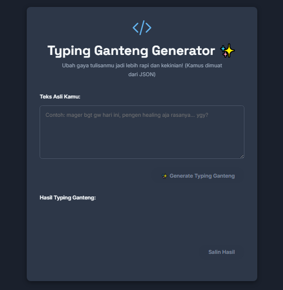

# Typing Ganteng Generator ✨

[]([https://rapihin.github.io/typing]) 
> Alat bantu online sederhana untuk mengubah gaya tulisan chat/santai/alay menjadi lebih rapi, sopan, tetap santai, dan keren ala "Typing Ganteng" yang sedang tren.

Website ini dibuat menggunakan HTML, CSS, dan JavaScript murni (Vanilla JS) dengan fokus pada pemrosesan di sisi klien (client-side).

## 🚀 Live Demo

Coba langsung aplikasinya di sini:
**[Typing Ganteng Generator Live]([URL-GITHUB-PAGES-ANDA])** *(Catatan: Performa saat pertama kali memuat mungkin memerlukan sedikit waktu karena memuat kamus kata.)*

## ✨ Fitur Utama

* **Input Teks Fleksibel:** Masukkan teks informal, singkatan, atau gaya bebas lainnya.
* **Konversi "Typing Ganteng":** Mengubah teks menjadi gaya yang lebih rapi, sopan, dan enak dibaca dengan aturan:
    * Penggantian kata/singkatan/slang umum (termasuk beberapa istilah lokal/Jawa).
    * Normalisasi huruf berulang (misal: `iyaaaa` -> `iyaa`).
    * Pelembutan vokal di akhir kata tertentu (misal: `iya` -> `iyaa`).
    * Penambahan/perbaikan tanda baca minimal (titik, koma, tilde `~`, elipsis `...`).
    * Kapitalisasi huruf pertama di awal kalimat dan setelah tanda baca akhir kalimat (., !, ?, ...).
    * Penambahan emoji `^^` sesekali secara otomatis.
* **Kamus Eksternal:** Menggunakan file `kamus.json` eksternal (dimuat via `Workspace`) yang berisi ~1800+ entri kata untuk penggantian.
* **Tombol Salin:** Menyalin hasil konversi dengan mudah ke clipboard.
* **Desain Responsif:** Tampilan menyesuaikan dengan berbagai ukuran layar (desktop & mobile).
* **Dark Mode Otomatis:** Mendukung tema gelap/terang sesuai pengaturan sistem pengguna.

## 💻 Teknologi

* HTML5
* CSS3 (dengan CSS Variables untuk tema)
* JavaScript (ES6+, Vanilla JS)
* JSON (untuk data kamus)
* Google Fonts (Inter, Space Grotesk)

## 🛠️ Cara Menggunakan

1.  Kunjungi [link live demo]([URL-GITHUB-PAGES-ANDA]). 2.  Tunggu sebentar hingga kamus selesai dimuat (tombol Generate akan aktif).
3.  Ketik atau tempel teks asli Anda di kotak input pertama.
4.  Klik tombol "✨ Generate Typing Ganteng".
5.  Hasil konversi akan muncul di kotak output di bawahnya.
6.  Klik tombol "Salin Hasil" untuk menyalin teks hasil konversi.

## ⚙️ Menjalankan Secara Lokal

Jika Anda ingin menjalankan proyek ini di komputer Anda sendiri:

1.  **Clone repositori ini:**
    ```bash
    git clone [URL-REPO-ANDA] 
    # Ganti [URL-REPO-ANDA] dengan URL repo GitHub Anda
    cd [NAMA-FOLDER-REPO]
    ```
2.  **Jalankan melalui Web Server Lokal:** Karena proyek ini menggunakan `Workspace()` untuk memuat `kamus.json`, Anda **tidak bisa** membukanya langsung dengan double-click file `index.html` (karena akan terkena masalah CORS). Anda perlu menjalankannya via server lokal. Contoh:
    * **Menggunakan Python:**
        ```bash
        # Jika punya Python 3
        python -m http.server 
        # Lalu buka http://localhost:8000 di browser
        ```
    * **Menggunakan VS Code & Live Server:** Install ekstensi "Live Server", klik kanan pada `index.html`, pilih "Open with Live Server".

## 📖 Kamus Kata (`kamus.json`)

* Kamus kata disimpan dalam format JSON di file `kamus.json`.
* Saat ini berisi sekitar 1800+ entri pasangan kata kunci dan nilai penggantinya.
* File ini dimuat secara asinkron saat halaman dibuka. Ukuran file ini mempengaruhi waktu loading awal dan performa proses konversi.

## 📄 Lisensi

Proyek ini dilisensikan di bawah [LISENSI_ANDA, contoh: MIT License]. 
---

Dibuat dengan bantuan dan eksplorasi bersama AI. Selamat mencoba! 😊
